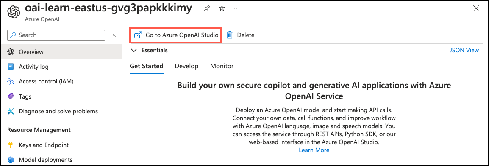
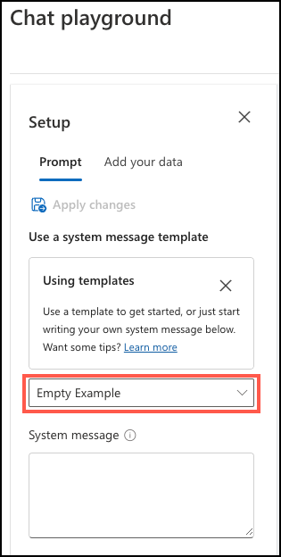

---
lab:
    title: 'Execute Query-focused Summarization'
    module: 'Build AI apps with Azure Database for PostgreSQL'
---

# Execute Query-focused Summarization

In this exercise, you use [Azure OpenAI Studio](https://oai.azure.com/) to explore the query-focused summarization capabilities of [Azure OpenAI](https://learn.microsoft.com/azure/ai-services/openai/overview) and experiment with prompt engineering.

## Before you start

You need an [Azure subscription](https://azure.microsoft.com/free) with administrative rights, and you must be approved for Azure OpenAI access in that subscription. If you need Azure OpenAI access, apply at the [Azure OpenAI limited access](https://learn.microsoft.com/legal/cognitive-services/openai/limited-access) page.

### Deploy resources into your Azure subscription

This step guides you through using Azure CLI commands from the Azure Cloud Shell to create a resource group and run a Bicep script to deploy the Azure services necessary for completing this exercise into your Azure subscription.

> Note
>
> If you are doing multiple modules in this learning path, you can share the Azure environment between them. In that case, you only need to complete this resource deployment step once.

1. Open a web browser and navigate to the [Azure portal](https://portal.azure.com/).

2. Select the **Cloud Shell** icon in the Azure portal toolbar to open a new [Cloud Shell](https://learn.microsoft.com/azure/cloud-shell/overview) pane at the bottom of your browser window.

    

3. At the Cloud Shell prompt, enter the following to clone the GitHub repo containing exercise resources:

    ```bash
    git clone https://github.com/MicrosoftLearning/mslearn-postgresql.git
    ```

4. Next, you run three commands to define variables to reduce redundant typing when using Azure CLI commands to create Azure resources. The variables represent the name to assign to your resource group (`RG_NAME`), the Azure region (`REGION`) into which resources will be deployed, and a randomly generated password for the PostgreSQL administrator login (`ADMIN_PASSWORD`).

    In the first command, the region assigned to the corresponding variable is `eastus`, but you can also replace it with a location of your preference. However, if replacing the default, you must select another [Azure region that supports abstractive summarization](https://learn.microsoft.com/azure/ai-services/language-service/summarization/region-support) to ensure you can complete all of the tasks in the modules in this learning path.

    ```bash
    REGION=eastus
    ```

    The following command assigns the name to be used for the resource group that will house all the resources used in this exercise. The resource group name assigned to the corresponding variable is `rg-learn-postgresql-ai-$REGION`, where `$REGION` is the location you specified above. However, you can change it to any other resource group name that suits your preference.

    ```bash
    RG_NAME=rg-learn-postgresql-ai-$REGION
    ```

    The final command randomly generates a password for the PostgreSQL admin login. **Make sure you copy it** to a safe place to use later to connect to your PostgreSQL flexible server.

    ```bash
    a=()
    for i in {a..z} {A..Z} {0..9}; 
       do
       a[$RANDOM]=$i
    done
    ADMIN_PASSWORD=$(IFS=; echo "${a[*]::18}")
    echo "Your randomly generated PostgreSQL admin user's password is:"
    echo $ADMIN_PASSWORD
    ```

5. If you have access to more than one Azure subscription, and your default subscription is not the one in which you want to create the resource group and other resources for this exercise, run this command to set the appropriate subscription, replacing the `<subscriptionName|subscriptionId>` token with either the name or ID of the subscription you want to use:

    ```azurecli
    az account set --subscription <subscriptionName|subscriptionId>
    ```

6. Run the following Azure CLI command to create your resource group:

    ```azurecli
    az group create --name $RG_NAME --location $REGION
    ```

7. Finally, use the Azure CLI to execute a Bicep deployment script to provision Azure resources in your resource group:

    ```azurecli
    az deployment group create --resource-group $RG_NAME --template-file "mslearn-postgresql/Allfiles/Labs/Shared/deploy.bicep" --parameters restore=false adminLogin=pgAdmin adminLoginPassword=$ADMIN_PASSWORD
    ```

    The Bicep deployment script provisions the Azure services required to complete this exercise into your resource group. The resources deployed include an Azure Database for PostgreSQL - Flexible Server, Azure OpenAI, and an Azure AI Language service. The Bicep script also performs some configuration steps, such as adding the `azure_ai` and `vector` extensions to the PostgreSQL server's _allowlist_ (via the azure.extensions server parameter), creating a database named `rentals` on the server, and adding a deployment named `embedding` using the `text-embedding-ada-002` model to your Azure OpenAI service. Note that the Bicep file is shared by all modules in this learning path, so you may only use some of the deployed resources in some exercises.

    The deployment typically takes several minutes to complete. You can monitor it from the Cloud Shell or navigate to the **Deployments** page for the resource group you created above and observe the deployment progress there.

    You may encounter a few errors when running the Bicep deployment script. The most common messages and the steps to resolve them are:

    - If you have not previously created an Azure AI Services resource, you may receive a message that the Responsible AI terms have not been read and accepted in your subscription:

        ```bash
        {"code": "ResourceKindRequireAcceptTerms", "message": "This subscription cannot create TextAnalytics until you agree to Responsible AI terms for this resource. You can agree to Responsible AI terms by creating a resource through the Azure Portal and trying again.}
        ```

        To resolve this error, run this command to create a Language service in your resource group and accept the Responsible AI terms for your subscription. Once the resource is created, you can rerun the command to execute the Bicep deployment script.

        ```bash
        az cognitiveservices account create --name lang-temp-$region-$ADMIN_PASSWORD --resource-group $RG_NAME --kind TextAnalytics --sku F0 --location $REGION --yes
        ```

    - If you previously ran the Bicep deployment script for this learning path and subsequently deleted the resources, you may receive an error message like the following if you are attempting to rerun the script within 48 hours of deleting the resources:

        ```bash
        {"code": "InvalidTemplateDeployment", "message": "The template deployment 'deploy' is not valid according to the validation procedure. The tracking id is '4e87a33d-a0ac-4aec-88d8-177b04c1d752'. See inner errors for details."}
    
        Inner Errors:
        {"code": "FlagMustBeSetForRestore", "message": "An existing resource with ID '/subscriptions/{subscriptionId}/resourceGroups/rg-learn-postgresql-ai-eastus/providers/Microsoft.CognitiveServices/accounts/oai-learn-eastus-gvg3papkkkimy' has been soft-deleted. To restore the resource, you must specify 'restore' to be 'true' in the property. If you don't want to restore existing resource, please purge it first."}
        ```

        If you receive this message, modify the `azure deployment group create` command above to set the `restore` parameter equal to `true` and rerun it.

    - If the selected region is restricted from provisioning specific resources, you must set the `REGION` variable to a different location and try rerunning the Bicep deployment script.

        ```bash
        {"status":"Failed","error":{"code":"DeploymentFailed","target":"/subscriptions/{subscriptionId}/resourceGroups/rg-learn-postgresql-ai-eastus2/providers/Microsoft.Resources/deployments/deploy","message":"At least one resource deployment operation failed. Please list deployment operations for details. Please see https://aka.ms/arm-deployment-operations for usage details.","details":[{"code":"ResourceDeploymentFailure","target":"/subscriptions/{subscriptionId}/resourceGroups/rg-learn-postgresql-ai-eastus/providers/Microsoft.DBforPostgreSQL/flexibleServers/psql-learn-eastus2-gvg3papkkkimy","message":"The resource write operation failed to complete successfully, because it reached terminal provisioning state 'Failed'.","details":[{"code":"RegionIsOfferRestricted","message":"Subscriptions are restricted from provisioning in this region. Please choose a different region. For exceptions to this rule please open a support request with Issue type of 'Service and subscription limits'. See https://review.learn.microsoft.com/en-us/azure/postgresql/flexible-server/how-to-request-quota-increase for more details."}]}]}}
        ```

8. Close the Cloud Shell pane once your resource deployment is complete.

## Create a completions model in Azure OpenAI

To use Azure OpenAI to perform query-focused summarization, you must deploy a large language model in your service. In this task, you deploy a `GPT 3.5 Turbo` model into your Azure OpenAI service.

1. In the [Azure portal](https://portal.azure.com/), navigate to your Azure OpenAI resource.

2. On the **Overview** blade, select **Go to Azure OpenAI Studio** in the toolbar.

    

3. In Azure OpenAI Studio, under **Management** in the resource menu, select **Deployments**, and then select **Create new deployment** from the toolbar on the **Deployments** page.

    

4. In the **Deploy model** dialog, select **gpt-35-turbo** as the model and enter "completions" into the **Deployment name** field, then select **Create**.

    

    Once created, you will see two deployments in your account, `embedding` and the newly created `completions`. The Bicep deployment script you ran to deploy Azure resources into your resource group deployed the' embedding' model.

## Experiment with Prompt Engineering and Summarization

In this task, you explore prompt engineering techniques, experimenting with various prompts and evaluating their impact on summarization quality in the Azure OpenAI Studio Chat playground.

1. In Azure OpenAI Studio, select **Chat** under **Playground** in the resource menu to open the **Chat playground**.

    

2. In the Chat playground's **Setup** panel, ensure the **Prompt** tab is selected, then select **Empty Example** in the **Select a template** dropdown. In the **Update system message** dialog, check the  **Don't show this again** box and select **Continue**.

    

3. When working with large language models, the prompt is typically referred to as the _system message_. To test the impact of different prompts, start by entering the following simple summarization prompt into the **System message** box and selecting **Apply changes**.

    ```md
    Summarize the following:
    ```

4. Copy the following `description` value retrieved from the `listings` table in the database, paste it into the user query box in the Chat playground, and then select the **Send** button.

    ```md
    This home is full of light, art and comfort. 5 mins to Downtown, 1 min to coffee. The Space This is a 1000 square foot, two bedroom, one bathroom house. This home has a large kitchen and two very large indoor eating spaces. The open plan kitchen and living room have two sets of French doors opening to west facing decks with additional seating and lots of room to play. The two bedrooms are very comfy with new carpet and separately controlled heating. Take advantage of our kitchen for meals, or venture out and sample Seattle's restaurants during your stay here! Start the morning off right with some coffee on the deck. Or head out to Tenth West, Storyville Coffee Company, or Caffe Fiore. Then enjoy a nice, leisurely breakfast at The Seattle Grind, Macrina Bakery & Café, or Bustle. All are popular stops near our house. Head out for some fresh morning air – go for a nice walk at Kerry Park, Parsons Gardens, or Discovery Park. Try Bounty Kitchen, Le Reve Bakery & Café, or 5 Spot for lunch.
    ```

    

5. Observe the summarization produced. The summary produced is a natural language summarization of the description provided. Still, the prompt did not give the model any specific instructions other than to generate a summary of the text. Hence, it had no guidelines, such as the number of sentences, to inform how it produced or formatted the summary.

6. Now, update the system message with a prompt that provides a bit more direction, selecting **Apply changes** after updating the **System message** field:

    ```md
    Generate a concise two-sentence summary of the following property description:
    ```

7. Copy the above property description again, paste it into the user query box, and select **Send**.

8. Observe the difference in the output. The summary is now more succinct and contains only two sentences.

    Providing specific instructions about how you want the output formatted steers the behavior of the language model and the response, or completion, it returns. This is the essence of prompt engineering.

9. You can experiment with other prompts to evaluate their impact on the model completion. Try a few prompts that specify different formats, such as:

    ```md
    Generate three bullet points summarizing the house layout of the following property description:
    ```

    or

    ```md
    Create a three-sentence summary of the following property description and generate a bulleted list of the names of nearby amenities:
    ```

Query-focused summarization allows you to generate summaries driven by instructions provided in prompts. This technique enables you to tailor responses from the language model based on user preferences and requirements. Using this approach, you could generate summaries to display short descriptions of properties that highlight the things most important to individual customers.

## Clean up

Once you have completed this exercise, delete the Azure resources you created. You are charged for the configured capacity, not how much the database is used. Follow these instructions to delete your resource group and all resources you created for this lab.

> Note
>
> If you plan on completing additional modules in this learning path, you can skip this task until you have finished all the modules you intend to complete.

1. Open a web browser and navigate to the [Azure portal](https://portal.azure.com/), and on the home page, select **Resource groups** under Azure services.

    

2. In the filter for any field search box, enter the name of the resource group you created for this lab, and then select your resource group from the list.

3. On the **Overview** page of your resource group, select **Delete resource group**.

    

4. In the confirmation dialog, enter the name of the resource group you are deleting to confirm and then select **Delete**.
