---
lab:
    title: 'Perform Inference using Azure Machine Learning'
    module: 'Build AI apps with Azure Database for PostgreSQL'
---

# Translate Text with Azure AI Translator

As the lead developer for Margie's Travel (MT), you have been asked to help develop a feature estimating nightly rental prices for short-term rentals. You have collected some historical data as a text file and would like to use this to train a simple regression model in Azure Machine Learning. Then, you would like to use that model against data you have hosted in Azure Database for PostgreSQL - Flexible Server.

In this exercise, you will create and deploy a model using Azure Machine Learning's Automated ML (AutoML) functionality. Then, you will use that deployed model to estimate nightly sale prices for short-term rental properties.

## Before you start

You need an [Azure subscription](https://azure.microsoft.com/free) with administrative rights.

### Deploy resources into your Azure subscription

This step will guide you through using Azure CLI commands from the Azure Cloud Shell to create a resource group and run a Bicep script to deploy the Azure services necessary for completing this exercise into your Azure subscription.

> Note
>
> If you are doing multiple modules in this learning path, you can share the Azure environment between them. In that case, you only need to complete this resource deployment step once.

1. Open a web browser and navigate to the [Azure portal](https://portal.azure.com/).

2. Select the **Cloud Shell** icon in the Azure portal toolbar to open a new [Cloud Shell](https://learn.microsoft.com/azure/cloud-shell/overview) pane at the bottom of your browser window.

    

3. At the Cloud Shell prompt, enter the following to clone the GitHub repo containing exercise resources:

    ```bash
    git clone https://github.com/MicrosoftLearning/mslearn-postgresql.git
    ```

    If you have already cloned this GitHub repo in a prior module, it will still be available to you and you may receive the following error message:

    ```bash
    fatal: destination path 'mslearn-postgresql' already exists and is not an empty directory.
    ```

    If you receive this message, you can safely continue to the next step.

4. Next, you run three commands to define variables to reduce redundant typing when using Azure CLI commands to create Azure resources. The variables represent the name to assign to your resource group (`RG_NAME`), the Azure region (`REGION`) into which resources will be deployed, and a randomly generated password for the PostgreSQL administrator login (`ADMIN_PASSWORD`).

    In the first command, the region assigned to the corresponding variable is `eastus`, but you can also replace it with a location of your preference. However, if replacing the default, you must select another [Azure region that supports abstractive summarization](https://learn.microsoft.com/azure/ai-services/language-service/summarization/region-support) to ensure you can complete all of the tasks in the modules in this learning path.

    ```bash
    REGION=eastus
    ```

    The following command assigns the name to be used for the resource group that will house all the resources used in this exercise. The resource group name assigned to the corresponding variable is `rg-learn-postgresql-ai-$REGION`, where `$REGION` is the location you specified above. However, you can change it to any other resource group name that suits your preference.

    ```bash
    RG_NAME=rg-learn-postgresql-ai-$REGION
    ```

    The final command randomly generates a password for the PostgreSQL admin login. Make sure you copy it to a safe place so that you can use it later to connect to your PostgreSQL flexible server.

    ```bash
    a=()
    for i in {a..z} {A..Z} {0..9}; 
       do
       a[$RANDOM]=$i
    done
    ADMIN_PASSWORD=$(IFS=; echo "${a[*]::18}")
    echo "Your randomly generated PostgreSQL admin user's password is:"
    echo $ADMIN_PASSWORD
    ```

5. If you have access to more than one Azure subscription, and your default subscription is not the one in which you want to create the resource group and other resources for this exercise, run this command to set the appropriate subscription, replacing the `<subscriptionName|subscriptionId>` token with either the name or ID of the subscription you want to use:

    ```azurecli
    az account set --subscription <subscriptionName|subscriptionId>
    ```

6. Run the following Azure CLI command to create your resource group:

    ```azurecli
    az group create --name $RG_NAME --location $REGION
    ```

7. Finally, use the Azure CLI to execute a Bicep deployment script to provision Azure resources in your resource group:

    ```azurecli
    az deployment group create --resource-group $RG_NAME --template-file "mslearn-postgresql/Allfiles/Labs/Shared/deploy-aml.bicep" --parameters adminLogin=pgAdmin adminLoginPassword=$ADMIN_PASSWORD
    ```

    The Bicep deployment script provisions the Azure services required to complete this exercise into your resource group. The resources deployed include an Azure Database for PostgreSQL flexible server and an Azure Machine Learning workspace. In order to instantiate the Azure ML workspace, the deployment script will also create all pre-requisite services for Azure ML, including an Azure Blob Storage account, an Azure Key Vault, an Azure Container Repository, an Azure Log Analytics Workspace, and an instance of Azure Application Insights. The Bicep script also performs some configuration steps, such as adding the `azure_ai` and `vector` extensions to the PostgreSQL server's _allowlist_ (via the azure.extensions server parameter) and creating a database named `rentals` on the server. Note that the Bicep file is different from the other modules in this learning path.

    The deployment typically takes several minutes to complete. You can monitor it from the Cloud Shell or navigate to the **Deployments** page for the resource group you created above and observe the deployment progress there.

    You may encounter a few errors when running the Bicep deployment script. The most common messages and the steps to resolve them are:

    - If the selected region is restricted from provisioning specific resources, you must set the `REGION` variable to a different location and rerun the Bicep deployment script.

        ```bash
        {"status":"Failed","error":{"code":"DeploymentFailed","target":"/subscriptions/{subscriptionId}/resourceGroups/rg-learn-postgresql-ai-eastus2/providers/Microsoft.Resources/deployments/deploy","message":"At least one resource deployment operation failed. Please list deployment operations for details. Please see https://aka.ms/arm-deployment-operations for usage details.","details":[{"code":"ResourceDeploymentFailure","target":"/subscriptions/{subscriptionId}/resourceGroups/rg-learn-postgresql-ai-eastus/providers/Microsoft.DBforPostgreSQL/flexibleServers/psql-learn-eastus2-{accountName}","message":"The resource write operation failed to complete successfully, because it reached terminal provisioning state 'Failed'.","details":[{"code":"RegionIsOfferRestricted","message":"Subscriptions are restricted from provisioning in this region. Please choose a different region. For exceptions to this rule please open a support request with Issue type of 'Service and subscription limits'. See https://review.learn.microsoft.com/en-us/azure/postgresql/flexible-server/how-to-request-quota-increase for more details."}]}]}}
        ```

8. Close the Cloud Shell pane once your resource deployment is complete.

## Train a machine learning model

You will train a new Azure Machine Learning Automated Machine Learning (AutoML) model [using the studio UI](https://learn.microsoft.com/azure/machine-learning/how-to-use-automated-ml-for-ml-models?view=azureml-api-2).

1. Download the `listings-regression.csv` file from [the mslearn-postgresql repository](../../Allfiles/Labs/Shared/listings-regression.csv).

2. In the [Azure portal](https://portal.azure.com/), navigate to your newly created Azure Machine Learning workspace.

3. Select the **Launch studio** button to open the Azure Machine Learning Studio.

    

4. Select the **Workspaces** menu option and then choose your newly created Azure Machine Learning workspace.

    

5. From the **Authoring** menu, select the **Automated ML** menu option. Then, select **+ New Automated ML job**.

    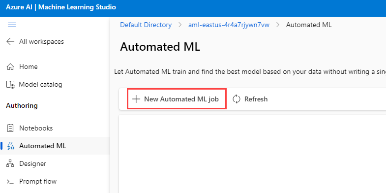

6. Enter `Rental-Listings` as the experiment name and then select the **Next** button.

    

7. From the **Select task type** menu, choose **Regression** as the task type. Then, select the **+ Create** button to create a new dataset.

    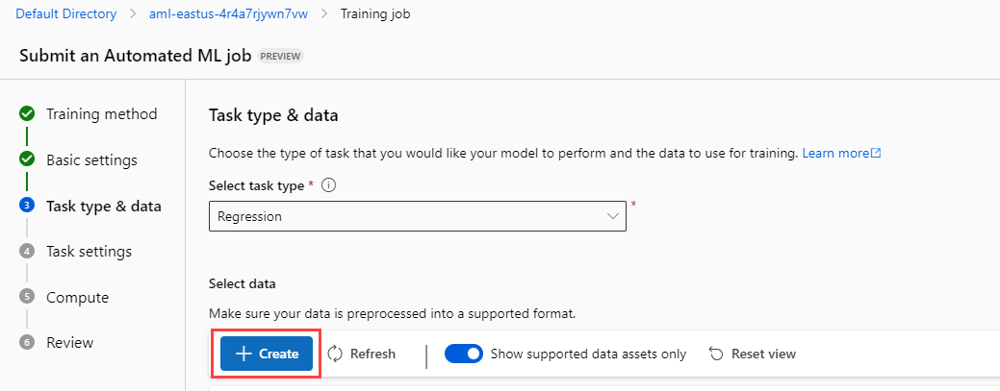

8. Set the data asset name to `RentalListings` and the dataset type as **Tabular** on the Create data asset screen. Then, select **Next** to continue to the next step of the creation process.

    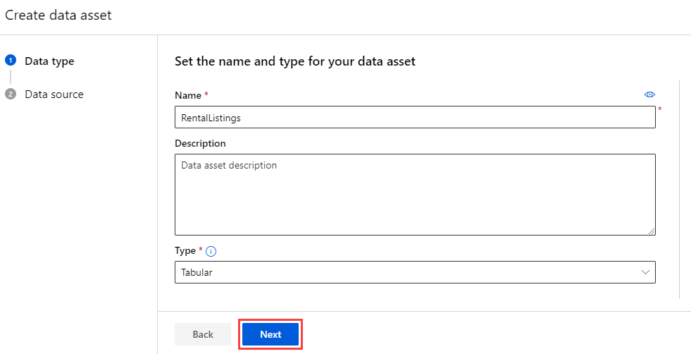

9. Choose **From local files** to upload a new file. Then, select the **Next** button. On the screen to select a datastore, choose **workplaceblobstore** and select **Next**. Then, select the **Upload files or folder** and select **Upload files**. This will bring up a file upload dialog. Navigate to the location where you have downloaded `listings-regression.csv` and upload this file. After you have completed the task, the file will appear in the upload list. Select **Next** to continue.

    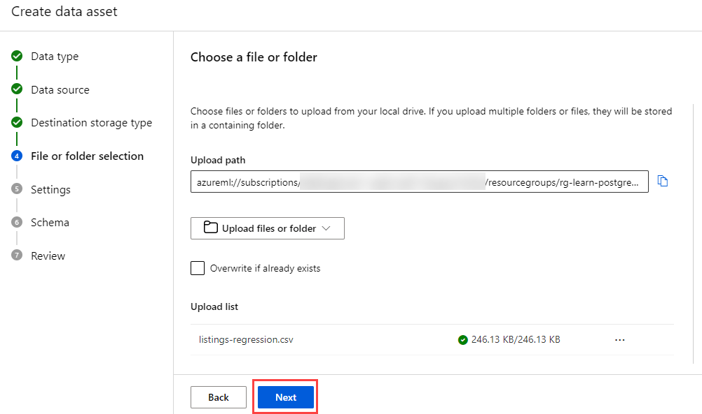

10. Navigate past the **Settings** and **Schema** menus by selecting the **Next** button. On the **Review** menu, select **Create** to create the data asset.

    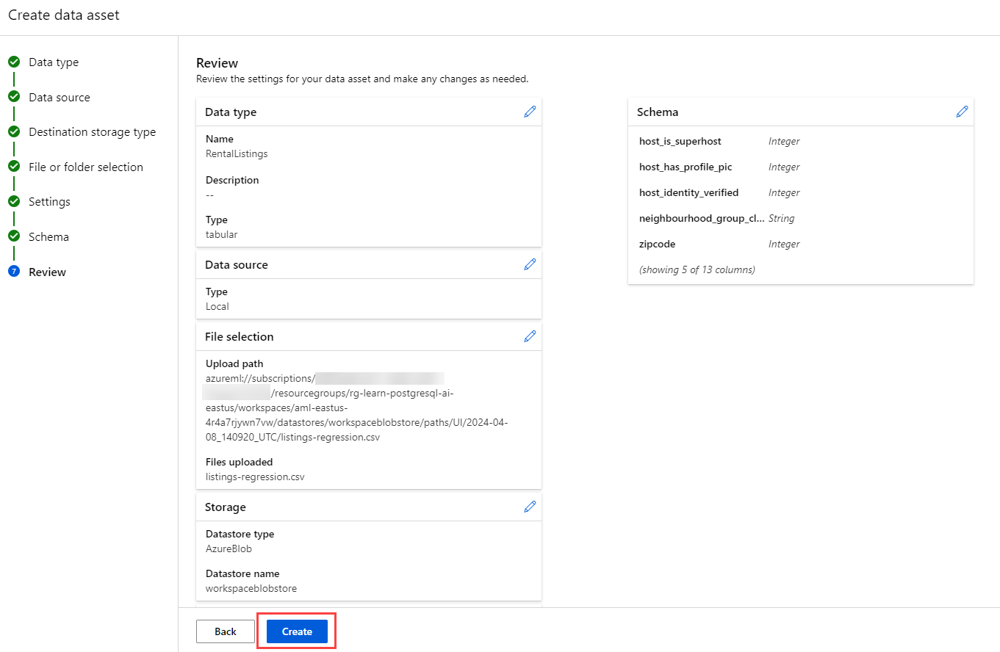

11. Creating the data asset will return you to the **Task type & data** menu page. Choose the `RentalListings` data asset from the **Select data** menu and then choose **Next** to continue to the next page.

    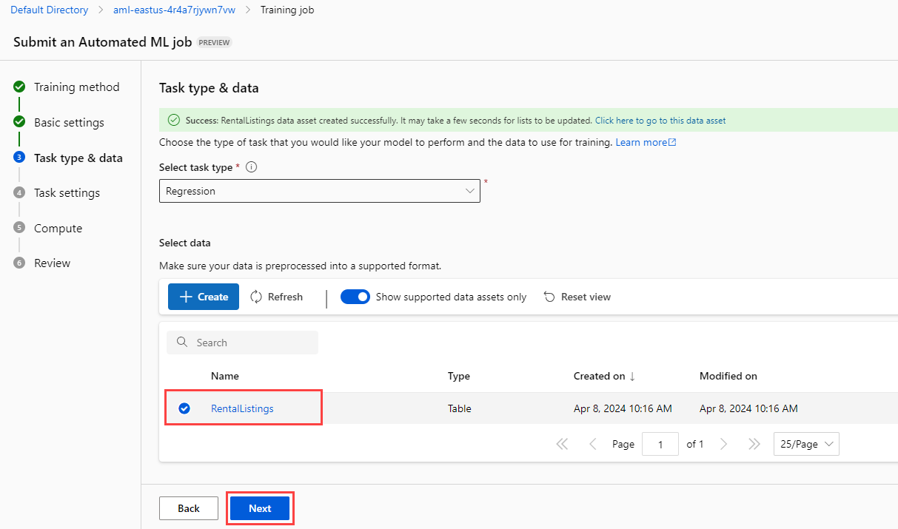

12. On the **Task settings** page, select **price** as the target column. Then, select the **View additional configuration settings** link.

    

13. On the **View additional configuration settings** fly-out pane, ensure that **Enable ensemble stacking** is selected. Then, select **Save** to save the change.

    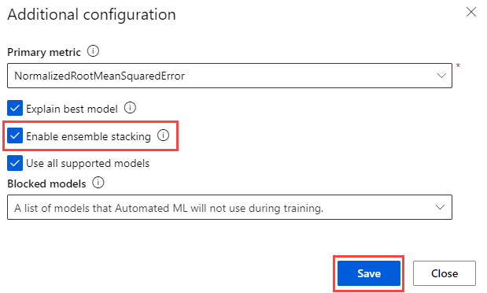

14. Returning to the **Task settings** page, in the **Limits** section, set the experiment timeout to **60** minutes to ensure it does not run longer than one hour. Also, select the **Enable early termination** box. Then select the **Next** button to continue.

    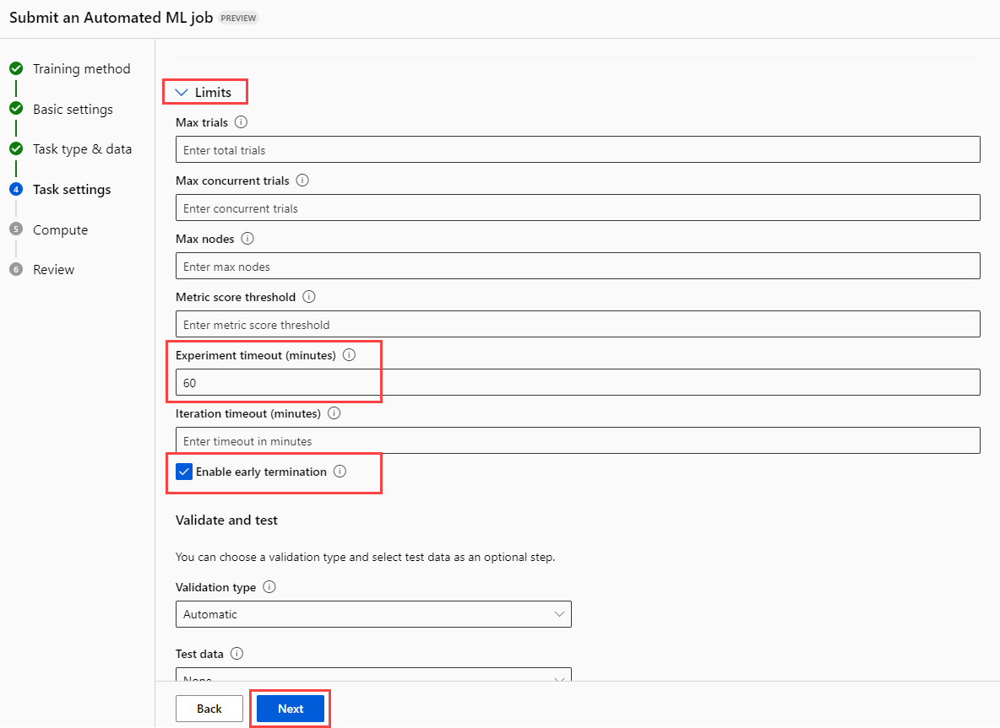

15. On the **Compute** page, ensure that the compute type is **Serverless** and you are using a **CPU**-based virtual machine at the **Dedicated** tier, using a virtual machine size of **Standard_DS3_v2** or similar. Then, select **Next**.

    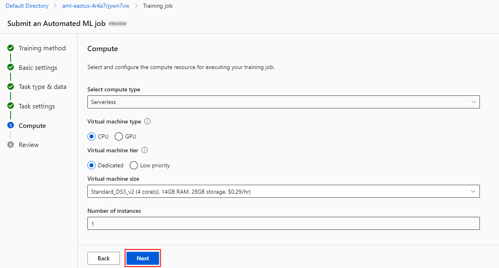

16. Once you have everything configured, submit the training job. Wait for the training job to complete. This may take slightly longer than one hour due to machine provisioning and training times. Once the process completes, the Status will display a green check mark and a text label of **Completed**.

    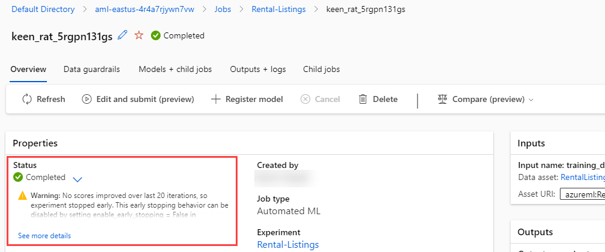

    > Note
    >
    > A warning message indicating that no scores have improved over the past 20 iterations is fine. This tells us that early termination occurred.

## Deploy the best-fitting Azure ML model

Now that you have trained a series of models using Azure Machine Learning, the next step is to deploy the best-fit model.

1. Select the **+ Register model** option on the completed job to register a model. Ensure that the **Job output** has the best model and then select **Next**.

    

2. Name the model **RentalListings** and then select the **Next** button.

    

3. Select the **Register** button to complete model registration. Then, select the link to go to the model.

    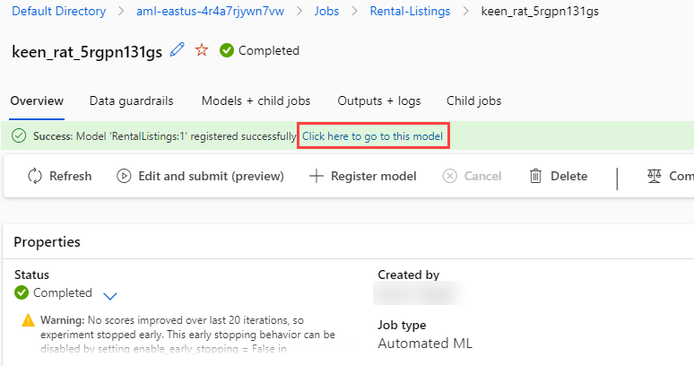

4. Select the **Deploy** button option and create a new **Real-time endpoint**.

    

5. On the deployment fly-out menu, set the **Virtual machine** to something like **Standard_DS2_v2** and the **Instance count** to 1. Select the **Deploy** button. Deployment may take several minutes to complete, as the deployment process includes provisioning a virtual machine and deploying the model as a Docker container.

    

6. After the endpoint deploys, navigate to the **Consume** tab and copy the REST endpoint and primary key so you can use them in the next section.

    

7. In order to test that your endpoint is running correctly, you can use the **Test** tab on your endpoint. Then, paste in the following block, replacing any input that currently exists. Select the **Test** button and you should see a JSON output containing an array with a single decimal value, indicating the number of US dollars you should expect this particular property to earn for a single night of rental.

    ```json
    {
      "input_data": {
        "columns": [
          "host_is_superhost",
          "host_has_profile_pic",
          "host_identity_verified",
          "neighbourhood_group_cleansed",
          "zipcode",
          "property_type",
          "room_type",
          "accommodates",
          "bathrooms",
          "bedrooms",
          "beds"
        ],
        "index": [0],
        "data": [["0", "0", "0", "Central Area", "98122", "House", "Entire home/apt", 4, 1.5, 3, 3]]
      }
    }
    ```

    

## Connect to your database using psql in the Azure Cloud Shell

In this task, you connect to the `rentals` database on your Azure Database for PostgreSQL server using the [psql command-line utility](https://www.postgresql.org/docs/current/app-psql.html) from the [Azure Cloud Shell](https://learn.microsoft.com/azure/cloud-shell/overview).

1. In the [Azure portal](https://portal.azure.com/), navigate to your newly created Azure Database for PostgreSQL flexible server.

2. In the resource menu, under **Settings**, select **Databases** select **Connect** for the `rentals` database.

    

3. At the "Password for user pgAdmin" prompt in the Cloud Shell, enter the randomly generated password for the **pgAdmin** login.

    Once logged in, the `psql` prompt for the `rentals` database is displayed.

4. Throughout the remainder of this exercise, you continue working in the Cloud Shell, so it may be helpful to expand the pane within your browser window by selecting the **Maximize** button at the top right of the pane.

    

## Install and configure the `azure_ai` extension

Before using the `azure_ai` extension, you must install it into your database and configure it to connect to your Azure AI Services resources. The `azure_ai` extension allows you to integrate the Azure OpenAI and Azure AI Language services into your database. To enable the extension in your database, follow these steps:

1. Execute the following command at the `psql` prompt to verify that the `azure_ai` and the `vector` extensions were successfully added to your server's _allowlist_ by the Bicep deployment script you ran when setting up your environment:

    ```sql
    SHOW azure.extensions;
    ```

    The command displays the list of extensions on the server's _allowlist_. If everything was correctly installed, your output must include `azure_ai` and `vector`, like this:

    ```sql
     azure.extensions 
    ------------------
     azure_ai,vector
    ```

    Before an extension can be installed and used in Azure Database for PostgreSQL flexible server, it must be added to the server's _allowlist_, as described in [how to use PostgreSQL extensions](https://learn.microsoft.com/azure/postgresql/flexible-server/concepts-extensions#how-to-use-postgresql-extensions).

2. Now, you are ready to install the `azure_ai` extension using the [CREATE EXTENSION](https://www.postgresql.org/docs/current/sql-createextension.html) command.

    ```sql
    CREATE EXTENSION IF NOT EXISTS azure_ai;
    ```

    `CREATE EXTENSION` loads a new extension into the database by running its script file. This typically creates new SQL objects such as functions, data types, and schemas. An error is thrown if an extension of the same name already exists. Adding `IF NOT EXISTS` allows the command to execute without throwing an error if it is already installed.

3. You will then need to use the `azure_ai.set_setting()` function to configure the connection to your Azure Machine Learning deployed endpoint. Configure the `azure_ml` settings to point to your deployed endpoint and its key. The value for `azure_ml.scoring_endpoint` will be your endpoint's REST URL. The value for `azure_ml.endpoint_key` will be the value of Key 1 or Key 2.

    ```sql
    SELECT azure_ai.set_setting('azure_ml.scoring_endpoint','https://<YOUR_ENDPOINT>.<YOUR_REGION>.inference.ml.azure.com/score');
    SELECT azure_ai.set_setting('azure_ml.endpoint_key', '<YOUR_KEY>');

## Create a table containing listings to price

You will need one table in order to store short-term rental listings that you would like to price.

1. Run the following command in the `rentals` database to create a new `listings_to_price` table.

    ```sql
    CREATE TABLE listings_to_price (
        id INT GENERATED BY DEFAULT AS IDENTITY PRIMARY KEY,
        host_is_superhost INT NOT NULL,
        host_has_profile_pic INT NOT NULL,
        host_identity_verified INT NOT NULL,
        neighbourhood_group_cleansed VARCHAR(75) NOT NULL,
        zipcode VARCHAR(5) NOT NULL,
        property_type VARCHAR(30) NOT NULL,
        room_type VARCHAR(30) NOT NULL,
        accommodates INT NOT NULL,
        bathrooms DECIMAL(3,1) NOT NULL,
        bedrooms INT NOT NULL,
        beds INT NOT NULL
    );
    ```

2. Next, run the following command in the `rentals` database to insert some new rental listing data.

    ```sql
    INSERT INTO listings_to_price(host_is_superhost, host_has_profile_pic, host_identity_verified,
        neighbourhood_group_cleansed, zipcode, property_type, room_type,
        accommodates, bathrooms, bedrooms, beds)
    VALUES
        (1, 1, 1, 'Queen Anne', '98119', 'House', 'Private room', 2, 1.0, 1, 1),
        (0, 1, 1, 'University District', '98105', 'Apartment', 'Entire home/apt', 4, 1.5, 2, 2),
        (0, 0, 0, 'Central Area', '98122', 'House', 'Entire home/apt', 4, 1.5, 3, 3),
        (0, 0, 0, 'Downtown', '98101', 'House', 'Entire home/apt', 4, 1.5, 3, 3),
        (0, 0, 0, 'Capitol Hill', '98122', 'House', 'Entire home/apt', 4, 1.5, 3, 3);
    ```

    This will insert 5 rows of new listing data.

## Create a function to translate listings data

In order to populate the language translation table, you will create a stored procedure to load data in batches.

1. Run the following command at the `psql` prompt to create a new function named `price_listing`.

    ```sql
    CREATE OR REPLACE FUNCTION price_listing (
        IN host_is_superhost INT, IN host_has_profile_pic INT, IN host_identity_verified INT,
        IN neighbourhood_group_cleansed VARCHAR(75), IN zipcode VARCHAR(5), IN property_type VARCHAR(30),
        IN room_type VARCHAR(30), IN accommodates INT, IN bathrooms DECIMAL(3,1), IN bedrooms INT, IN beds INT)
    RETURNS DECIMAL(6,2)
    AS $$
        SELECT CAST(jsonb_array_elements(inference.inference) AS DECIMAL(6,2)) AS expected_price
        FROM azure_ml.inference(('
        {
            "input_data": {
                "columns": [
                "host_is_superhost",
                "host_has_profile_pic",
                "host_identity_verified",
                "neighbourhood_group_cleansed",
                "zipcode",
                "property_type",
                "room_type",
                "accommodates",
                "bathrooms",
                "bedrooms",
                "beds"
                ],
                "index": [0],
                "data": [["' || host_is_superhost || '", "' || host_has_profile_pic || '", "' || host_identity_verified || '", "' ||
                neighbourhood_group_cleansed || '", "' || zipcode || '", "' || property_type || '", "' || room_type || '", ' ||
                accommodates || ', ' || bathrooms || ', ' || bedrooms || ', ' || beds || ']]
            }
        }')::jsonb, deployment_name=>'rentallistings-1');
    $$ LANGUAGE sql;
    ```

2. Execute the function using the following SQL command:

    ```sql
    SELECT * FROM price_listing(0, 0, 0, 'Central Area', '98122', 'House', 'Entire home/apt', 4, 1.5, 3, 3);
    ```

    This will return a nightly rental price estimate in decimal format.

3. Call the function for each row in the `listings_to_price` table using the following SQL command:

    ```sql
    SELECT l2p.*, expected_price
    FROM listings_to_price l2p
        CROSS JOIN LATERAL price_listing(l2p.host_is_superhost, l2p.host_has_profile_pic, l2p.host_identity_verified,
            l2p.neighbourhood_group_cleansed, l2p.zipcode, l2p.property_type, l2p.room_type,
            l2p.accommodates, l2p.bathrooms, l2p.bedrooms, l2p.beds) expected_price;
    ```

    This will return five rows, one for each row in `listings_to_price`. It will include all of the columns in the `listings_to_price` table and the result of the `price_listing()` function as `expected_price`.

## Clean up

Once you have completed this exercise, delete the Azure resources you created. You are charged for the configured capacity, not how much the database is used. Follow these instructions to delete your resource group and all resources you created for this lab.

> Note
>
> If you plan on completing additional modules in this learning path, you should still run this task and then run the deployment script in the next module you intend to complete.

1. Open a web browser and navigate to the [Azure portal](https://portal.azure.com/), and on the home page, select **Resource groups** under Azure services.

    

2. In the filter for any field search box, enter the name of the resource group you created for this lab, and then select the resource group from the list.

3. On the **Overview** page of your resource group, select **Delete resource group**.

    

4. In the confirmation dialog, enter the name of the resource group you are deleting to confirm and then select **Delete**.
